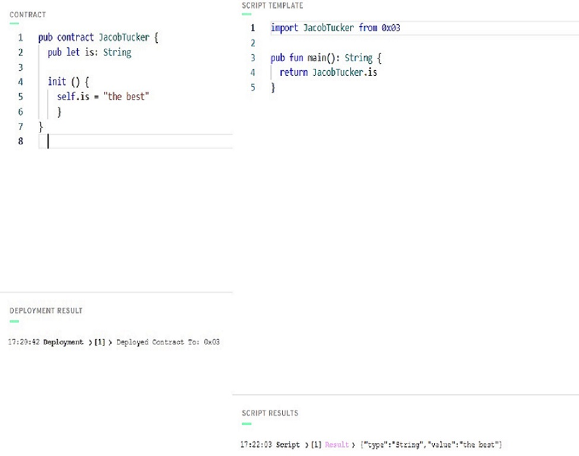

# **Notes**

## *Contract Code Format*
```
/// STATE

pub contract contractname {
  pub let variablename: Type
  
/// LOGIC
  
  init() {
    self.variable = VariableType
    }
 }
 ```
 ## *Importing Contract Script*
 ```
 import contractname from address
 
 pub fun functionname(): returnType {
  return contractname.variablename
 }
  ```
 ## **Quest**


